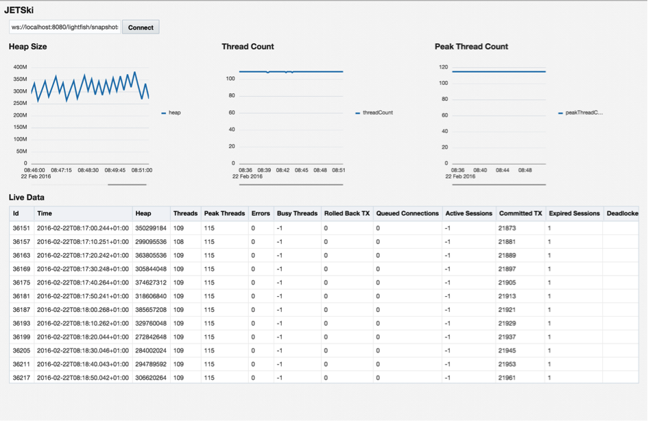

# jetski

Sample Application using Oracle JET together with DukeScript. This application was written for an Article in "Java Magazin". It demonstrates the use of [Oracle JET](http://www.oracle.com/webfolder/technetwork/jet/index.html) Framework in DukeScript Applications.

## Running the project

The Application depends on Adam Bien's [Lightfish](http://lightfish.adam-bien.com/) Project, an opensource Java EE 7 application which gathers and persists periodically GlassFish's monitoring data. In order to Run it, you need to first install and run Lightfish in Glassfish or Payara. I've tested it with Glassfish 4.1. On the website of the running application, press the "Start" Button to enable monitoring. Lighfish will open a Websocket and serve Snapshot data at ws://localhost:8080/lightfish/snapshots/json/.

Now deploy the "JetSki" application to a server of your choice and open index.html. Pressing the "connect" Button will connect the application with the websocket to retrieve and display data.

For comparison, the plain JavaScript version is [here](https://github.com/dukescript/jetski/).
